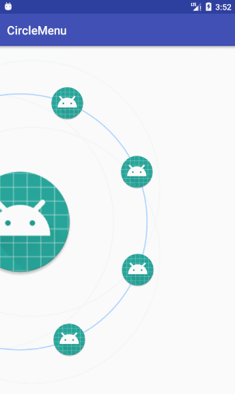

# CircleMenu

 

一个简单的圆形菜单，实现几个功能

1. 可拖动圆环上的菜单，放开手指后菜单恢复位置
2. 手指点击到圆环上的菜单后菜单放大，放开手指后菜单恢复大小
3. 可以对菜单设置点击监听，点击圆环上的菜单后拖动手指到菜单外取消点击

定义了这些 attrs 属性
```xml
<declare-styleable name="CircleMenu">
    <attr name="centerX" format="dimension" /> //中心点的 x 坐标
    <attr name="radius" format="dimension" /> //圆环的半径
    <attr name="centerItemRadius" format="dimension" /> //中心菜单的半径
    <attr name="itemRadius" format="dimension" /> //圆环上菜单的半径
    <attr name="itemTextMargin" format="dimension" /> //圆环上菜单位置与图标的间距
    <attr name="backgroundCircleColor" format="color" /> //背景圆环的颜色
    <attr name="itemCircleColor" format="color" /> //圆环的颜色
    <attr name="centerItemDrawable" format="reference" /> //中心菜单的图案
    <attr name="halfCircle" format="boolean" /> //是否显示一半圆环，默认显示一半圆环，控制圆环图标的位置
</declare-styleable>
```

可以使用 circleMenu.mPresenter 下的这些方法
```kotlin
fun setCenterPoint(x: Int?, y: Int?): Presenter //设置中心点坐标
fun setCenter(centerData: CenterData): Presenter //用来设置中心菜单图标
fun addItem(itemData: ItemData): Presenter //添加圆环上的菜单
fun addItems(itemDataList: List<ItemData>): Presenter //添加圆环上的菜单
fun setItemRadius(radius: Float): Presenter //设置圆环上菜单的半径
fun setOnCenterItemClickListener(listener: () -> Unit): Presenter //设置中心菜单点击事件
fun setOnItemClickListener(listener: (position: Int) -> Unit): Presenter //设置圆环上菜单的点击事件
fun startBackgroundAnimator(): Presenter //开启背景动画，默认开启
fun stopBackgroundAnimator(): Presenter //停止背景动画
fun setHalfCircle(isHalfCircle: Boolean): Presenter //是否显示一半圆环，默认显示一半圆环，控制圆环图标的位置
```

因为我现在只用到或者想到这些功能，可以讨论添加